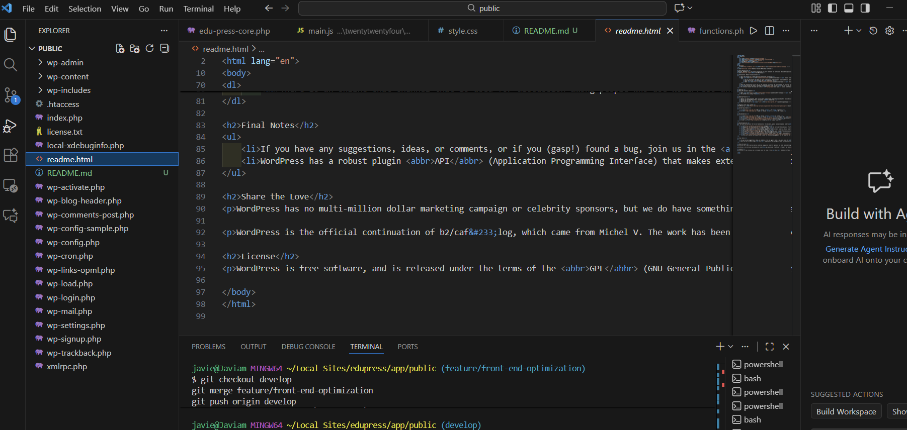

<<<<<<< Updated upstream
# ⚙️ Feature: API Integration and Back End Optimization
=======
# 📚 EduPress Pro: Optimized Full Stack E-Learning Platform

This project demonstrates proficiency in **Full Stack development (Front End and Back End)** within the WordPress ecosystem, with a rigorous focus on **performance optimization, security, scalability, and external systems integration.**

## 🛠️ Technology Stack and Development Environment

| Category | Technology / Tool | Application in EduPress Pro |
| :--- | :--- | :--- |
| **Local Environment** | **Local by Flywheel (Free)**, **VS Code** | Used for hosting and professional development in a clean Nginx/PHP/MySQL stack. |
| **Back End & Core** | **PHP 8.2+**, **MySQL 8.0+** | Used for Core Plugin development, back end logic, and REST API management. |
| **Advanced Front End** | **JavaScript**, HTML5, CSS3 | **JavaScript** DOM manipulation for interactivity (Form/API List). **CSS** Responsive design using Flexbox/Grid and corporate styling. |
| **Platform** | **WordPress 6.x** | Development based on Child Themes, use of Core Functionality Plugins, and Gutenberg-compatible layout. |

## 🔑 Key Technical Features (The "Wow" Factor)

### 1. REST API Integration (Full Stack - PHP Logic)

* **Purpose:** To demonstrate the ability to integrate external systems and manage data transfer between servers (Full Stack capability).
* **Service Used:** We utilized JSONPlaceholder, a free and public REST API (fictional) designed for simulation and prototyping.
* **Back End Implementation:** The code resides in the Core Plugin (`edu-press-core`) and uses the secure WordPress function (`wp_remote_get`) to consume the endpoint, process the JSON, and render the "Data Integration Panel" on the Home page.

### 2. Component Development and Performance (Front End)

* **Design (CSS):** The site uses clean styles, modern typography, and a CSS Grid/Flexbox layout to present the data in a responsive card format, simulating a clean desktop application interface (Articulate style).
* **Interactivity (JavaScript):** The `main.js` file implements validation of forms and handling of mouse events on the API list, demonstrating DOM manipulation and smooth UX.
* **Performance Optimization:** JavaScript files are loaded non-blocking (`wp_enqueue_script` with the `true` argument in the footer), prioritizing the initial site load time (WPO).

### 3. Code Management and Workflow

* **Advanced Git Flow:** Demonstration of a professional workflow using feature branches (`develop` / `feature/*`), which ensures code integrity during merges.

---

**Developer:** [Javiam Allen ♥ ](https://www.linkedin.com/in/javierallend1/)
**GitHub User:** Javiamallen
**Local Demo URL:** `edupress.local`

## 🚀 App Working here

## 🖼️ Interface

 
 
>>>>>>> Stashed changes
